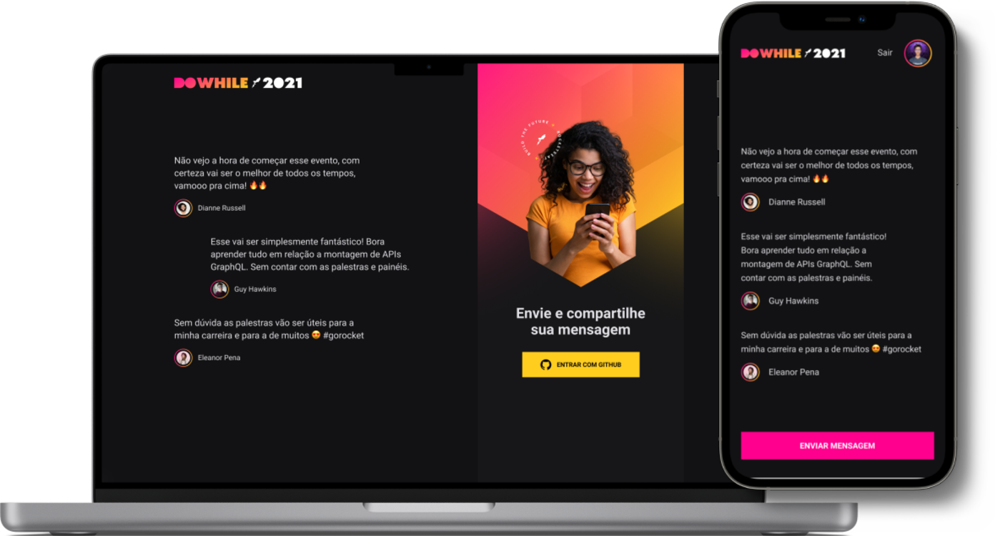

<h1 align="center">
  
</h1>

<br><br>

<p align="center">
  <a href="#-about-the-project">About the project</a> •
  <a href="#-technologies">Technologies</a> •
  <a href="#-getting-started">Getting started</a> •
  <a href="#-license">License</a>
</p>

<p align="center">
  
</p>
 
 
  
## 👩‍💻 About the project

Application for answering questions about DoWhile, an event made by Rocketseat, you can answer, solve doubts and interact with the participants.

## 🚀 Technologies

- [ReactJS](https://reactjs.org/)
- [TypeScript](https://www.typescriptlang.org/)
- [React Native](https://reactnative.dev/)
- [Expo](https://expo.io/)
- [Moti](https://moti.fyi/)
- [Vitejs](https://vitejs.dev/)
- [Socket.IO](https://socket.io/)
- [React Native Stitches](https://github.com/Temzasse/stitches-native)
- [Express](https://expressjs.com/)
- [Prisma](https://www.prisma.io/)

## 💻 Getting started

### Requirements

- [Node.js](https://nodejs.org/en/)
- [Yarn](https://classic.yarnpkg.com/) or [NPM](https://www.npmjs.com/) _(examples are with yarn)_

**Clone the project and access the folder**

```bash
$ git clone https://github.com/leandrorodrigues00/doWhile && cd doWhile

```

**Follow the steps below**

```bash
# Install the dependencies
$ yarn


# Start the app
$ yarn dev

# Navigate to http://localhost:3000
# The app will automatically reload if you change any of the source files.
```

## 📝 License

This project is licensed under the MIT License - see the [LICENSE](LICENSE) file for details.

---

<p align="center">
  Made with 💜&nbsp; by  Leandro Rodrigues
</p>
